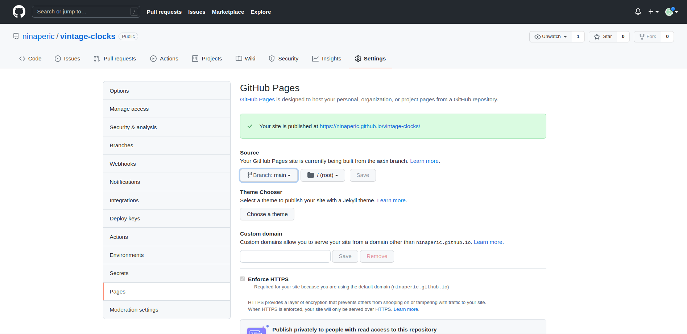

# Vintage Clocks Shop

Vintage Clocks Shop is a website that represents our shop where we sell vintage clocks. It is made so the people can find us and contact us.

## User Experience (UX)

### User stories 

- As a user I want to 
- As a user I want to 
- As a user I want to 
- As a user I want to 
- As a user I want to 
- As a user I want to 

## Site Structure

Vintage Clocks Shop has three pages About, Gallery and Contact. On the About page the user can read the story about our shop. Gallery and Contact pages provide a collection of images with our latest clocks and information about how to find us and contact us.

## Design Choices

- Typography

- Colour Scheme

## Features

### Existing Features (Functions and structure)

- __Navigation Bar__

  - Featured on all three pages, the full responsive navigation bar includes links to the About page, Gallery and Contact page and is identical in each page to allow for easy navigation.
  - This section will allow the user to easily navigate from page to page across all devices without having to revert back to the previous page via the ‘back’ button. 

- __About Page__

  - About page provides information to the user about the store, the reason why is was open,when it was open and it's opening hours.

- __Gallery Page__

  - Gallery page will provide the user with collection of pictures to see some of the newest clocks we have in our shop.

- __Contact Page__

  - This page allows the user to find us and contact us. There is written our email adress and phone number.
  - The user will be able to send us a message but for that the user will be asked first to write their name and email address. 

 - __The Footer__ 

  - The footer section includes links to the relevant social media sites. The links will open to a new tab to allow easy navigation for the user. 
  - The footer is valuable to the user as it encourages them to keep connected via social media.

### Future Features

- Gallery becomes a shop page where user can select and add clocks to the shoping cart. 
- Add shopping cart page where the user can finish shopping.
- Add shopping cart icon to header.
- Add shopping functionality.

## Technologies Used

- HTML5: Used for the web site content.
- CSS: Used to style the web site.
- VS Code: The editor used for coding.
- Github: Used as version control system.
- Github Pages: Used to deploy web site online.
- Bootstrap grid system: CSS for grid system was extracted into custom-style.css.

## Testing 

### Validator Testing 

- HTML
  - No errors were returned when passing through the official [W3C validator](https://validator.w3.org/nu/?doc=https%3A%2F%2Fninaperic.github.io%2Fvintage-clocks%2F%3Ffbclid%3DIwAR0xLERJXKN7cHw1VtFblWWuqU_R_KGFj89za0jHKwLtPgH1z2NwtI8ex1o)
- CSS
  - No errors were found when passing through the official [(Jigsaw) validator](https://jigsaw.w3.org/css-validator/validator?uri=https%3A%2F%2Fninaperic.github.io%2Fvintage-clocks%2F%3Ffbclid%3DIwAR0xLERJXKN7cHw1VtFblWWuqU_R_KGFj89za0jHKwLtPgH1z2NwtI8ex1o&profile=css3svg&usermedium=all&warning=1&vextwarning=&lang=en)

### Responsivness Test

- Responsivness test was done using Chrome Dev tools.

|        | iPhone 6/7/8 Plus | Pixel 2 XL| iPhone 5 | iPad | iPad Pro | Display <1200px | Display >1200px |
|--------|-------------------|-----------|----------|------|----------|-----------------|-----------------|
| Render | pass              | pass      | pass     | pass | pass     | pass            | pass            |
| Images | pass              | pass      | pass     | pass | pass     | pass            | pass            |
| Links  | pass              | pass      | pass     | pass | pass     | pass            | pass            |

### Browser Compatibility

Vintage Clocks Shop is functional and properly displayed in the following web browsers: Google Chrome, Mozilla Firefox and Safari. 

### Testing User Stories

### Known Bugs

- Resolved 
  - `alt` attribute was missing on some images.
  - Textarea head `type` attribute which was not valid.
  - Some images used `.webp` format which was not supported in Safari.

- Unresolved
 - One of the images fails to load in Safari.

 

## Deployment

- The site was deployed to GitHub pages. The steps to deploy are as follows: 

  1. In the GitHub repository, navigate to the Settings tab 
  2. From the source section drop-down menu, select the Master Branch
  3. Once the master branch has been selected, the page will be automatically refreshed with a detailed ribbon display to indicate the successful deployment. 

The live link can be found here - https://ninaperic.github.io/vintage-clocks/

- Cloning project locally 

1. On the repository, click on the code tab.
2. Click on the code button the right.
3. In the Clone with HTTPS section, click on the clipboard icon to copy the given URL.
4. In your IDE of choice, open Git Bash.
5. Change the current working directory to the location where you want the cloned directory to be made.
6. Type git clone, and then paste the URL copied from GitHub.
7. Press enter and the local clone will be created.

## Credits  

### Content 

- To make our pages responsive we used example of the bootstrap responsive css (https://getbootstrap.com/docs/3.4/css/)
- The icons in the footer were taken from [Font Awesome](https://fontawesome.com/)

### Media

- The photos used on this website were taken from Google (https://google.com/)

